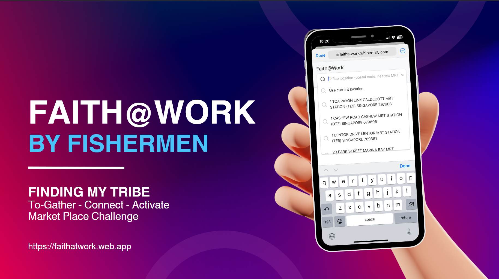
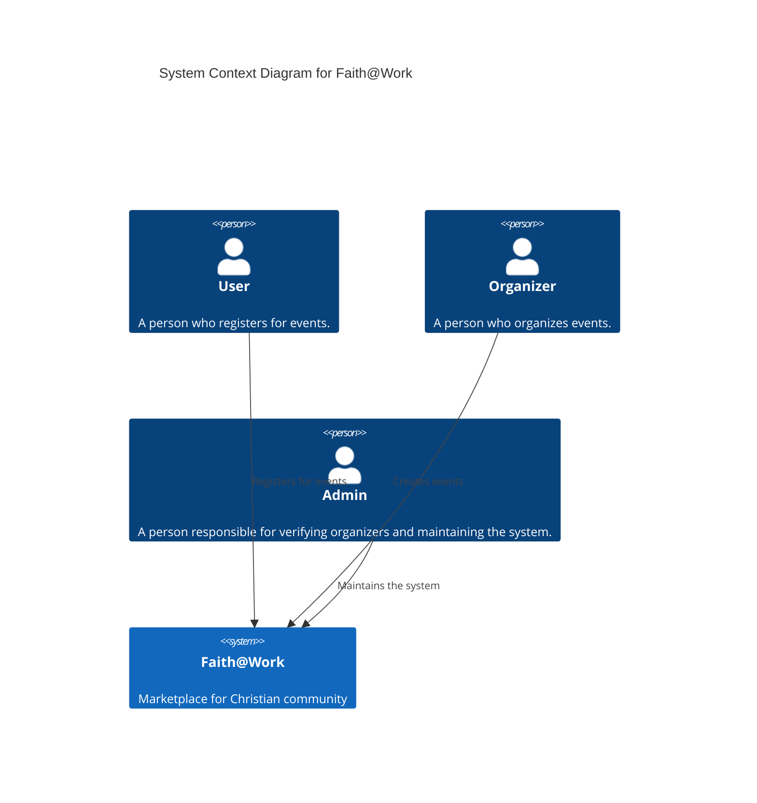

# Faith@Work
A browser-based app called Faith@Work, to connect Christians at their workplace


Developed by Tommy Lim, John Yong, Chin Wanying, Kenny Tan, Bryan Sim, Peter Tan during [#HACK2024](https://hack.indigitous.org/hack2024/)

# Introduction
This project was done as part of the #HACK2024 hackathon in October 2024 with a team of 6 hackathon participants. As part of the missional challenge to gather Christians at the workplace, over a 7-day hack, we ideated and created a browser-based app called Faith@Work, which connects Christians through activities and events near their workplace.

# Product demo
The browser-based app shows how a user can quickly find suitable discipleship or fellowship activities near their workplace.


# Product slide deck

<a href="assets/%23HACK2024%20-%20Faith%40Work.pdf" target="_blank" class="image fit">
    
</a>

# Architecture overview


## Teck stack
- Vue.js
- Cloud Run Service
- Cloud Firestore
- Eventbrite API


# Quickstart
```bash
pyenv local 3.12.7
python src/main.py
```

# Developer setup (Linux/Mac)

Note: For developing on Windows, install [wsl](https://learn.microsoft.com/en-us/windows/wsl/setup/environment) for a virtual Linux environment (eg. Ubuntu)

Prerequisite packages
```bash
apt update -y
apt install -y make build-essential libssl-dev zlib1g-dev libbz2-dev libreadline-dev libsqlite3-dev wget curl llvm libncurses5-dev libncursesw5-dev xz-utils tk-dev libffi-dev liblzma-dev python3-openssl git tk-dev libsqlite3-dev libffi-dev libreadline-dev
curl https://pyenv.run | bash
```

Append this to your .bashrc or .zshrc
```bash
export PYENV_ROOT="$HOME/.pyenv"
export PATH="$PYENV_ROOT/bin:$PATH"
if command -v pyenv 1>/dev/null 2>&1; then
 eval "$(pyenv init -)"
fi
````

Setup Python virtual environment (change as needed)
```bash
pyenv install 3.12.7
pyenv versions
pyenv local 3.12.7
```

Install docker and check that it is running (Optional) (Ubuntu)
```bash
sudo snap install docker
docker --version

sudo apt install docker-compose

sudo snap disable docker
sudo snap enable docker
sudo snap start docker
sudo snap services docker
sudo addgroup --system docker
sudo adduser $USER docker
newgrp docker
ls -l /var/run/docker.sock
sudo chmod 666 /var/run/docker.sock

docker-compose up --build
docker-compose down
```

Deploy as Cloud Run Service
```bash
sudo snap install --classic google-cloud-cli

gcloud auth login
gcloud config set project faith-at-work-backend-440004
gcloud config set run/region asia-east1

gcloud run deploy faith-at-work-backend --timeout=600 --service-account 392395172966-compute@developer.gserviceaccount.com --memory=256Mi --cpu=1 --region asia-east1 --source .
```
